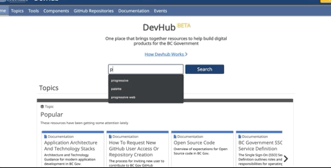
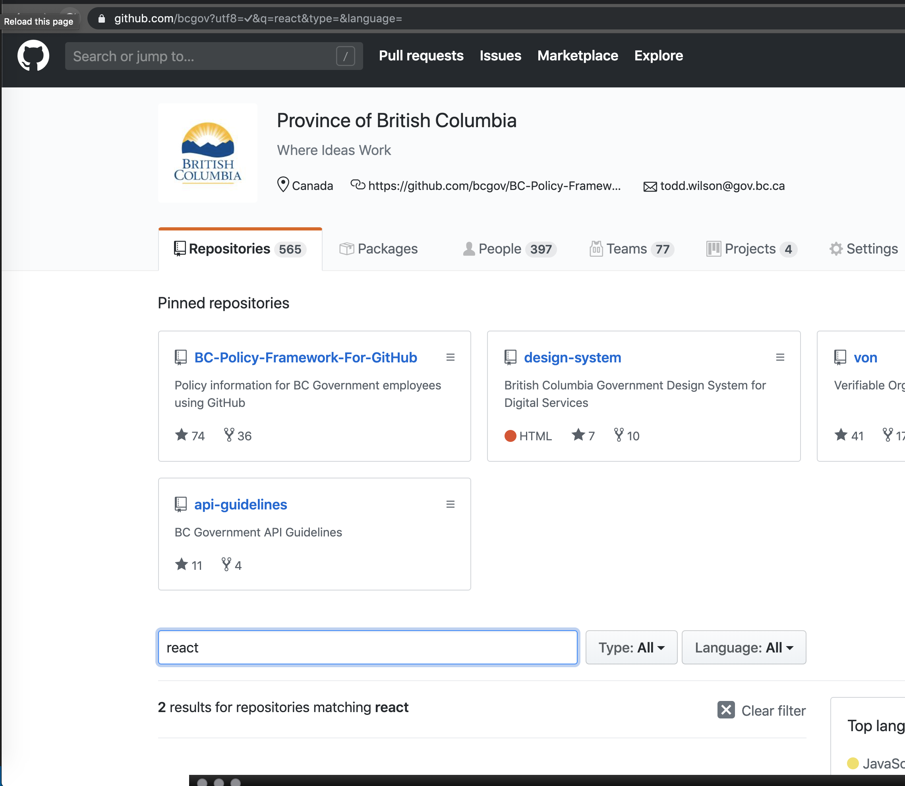

## Looking for Resources 

Some of the main principles Developer's go by are "don't repeat yourself" and "don't reinvent the wheel". 

With that being said, it can be difficult to look for solid code examples, good project skeletons and so on. 

Here are a brief list of repositories that contain a solid starting point to build an app. In addition they 
already contain many of the best practices when it comes to administering an app in our __Openshift Cluster__. 

## Case Study: [TFRS Repo](https://github.com/bcgov/tfrs)

### Highlights

- Poly-Stack Repository with great examples of _infrastructure as code_
- The repository is very well structured
- All parts of the _stack_ are neatly organized by directory. Openshift Components for the stack are organized in the same way.
- Languages:
  - Python
  - Javascript
  - Groovy
- Technologies:
  - React JS
  - [BDD Stack](https://github.com/BCDevOps/BDDStack/)
  - Django
  - PostGres
  - Docker Compose
  - SonarQube
  - [Database Backups /w BackupContainer](https://github.com/BCDevOps/backup-container) * *for backing up pg databases*
  - Jenkins

## Case Study: [Range API Repo](https://github.com/bcgov/range-api)

### Highlights

- Single Stack Repository that follows __Node JS, Express__ Conventions very well
- Great Examples of __Unit Tests__
- Has an example of modifying the Openshift __S2I Assemble Script__
- Languages:
  - Javascript
- Technologies:
  - Node JS/Express
  - SonarQube
  - Swagger
  - Knex JS

## Finding Repos

Here are a couple of good ways to find repos. 

1. Using the Devhub

> Requires being logged in

2. Using the Github Native Search

