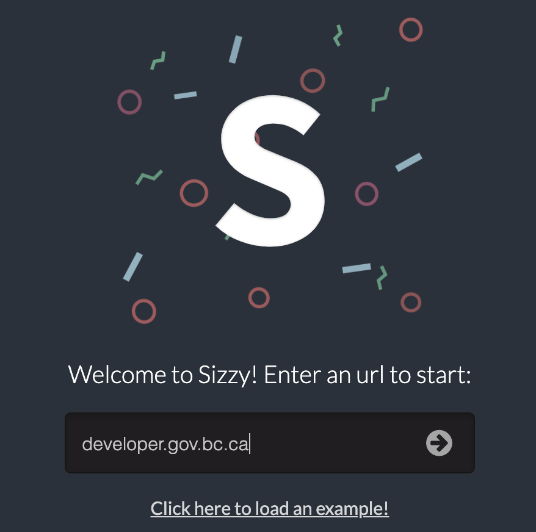
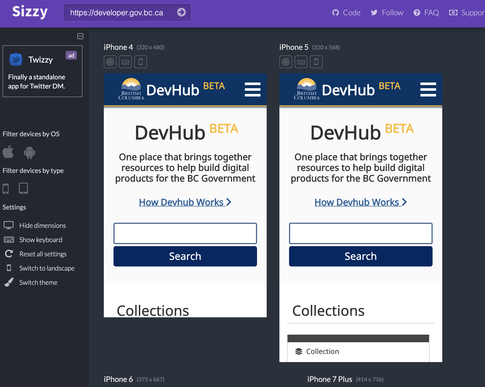

> https://sizzy.co

# Sizzy - Responsive Design Testing

Sizzy is a great online tool that shows what a web app would look like through several
common mobile phones and tablets. 

Some viewports you can test are:

- iPhone 4
- iPhone 5
- iPhone 6
- iPhone 7
- Samsung Galaxy S4
- Nexus 7

and more

## How To Use it

It's as simple as going to the [application](https://sizzy.co) and entering your URL of choice!

and bam! 

